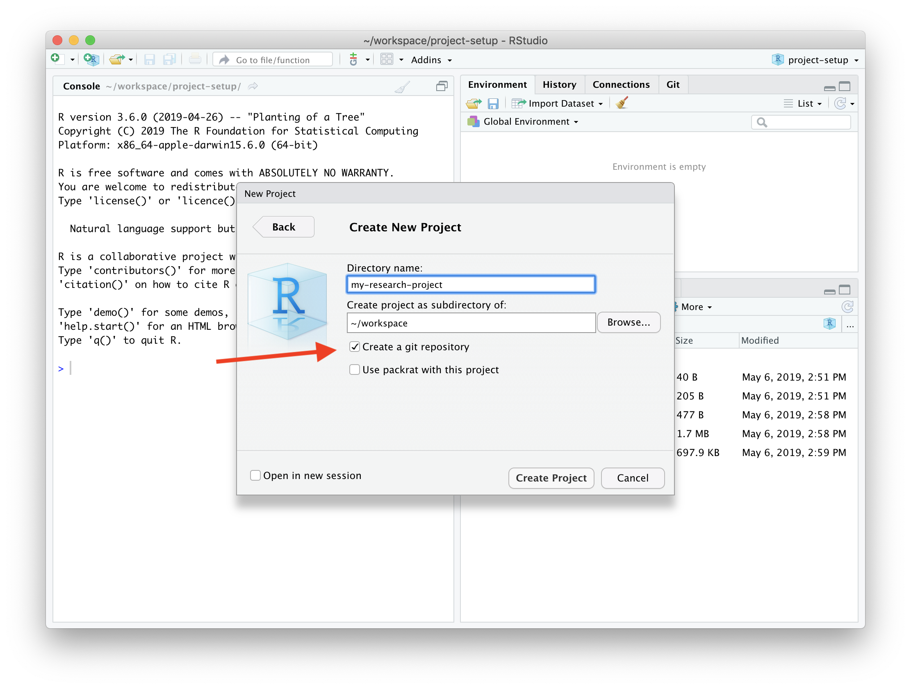
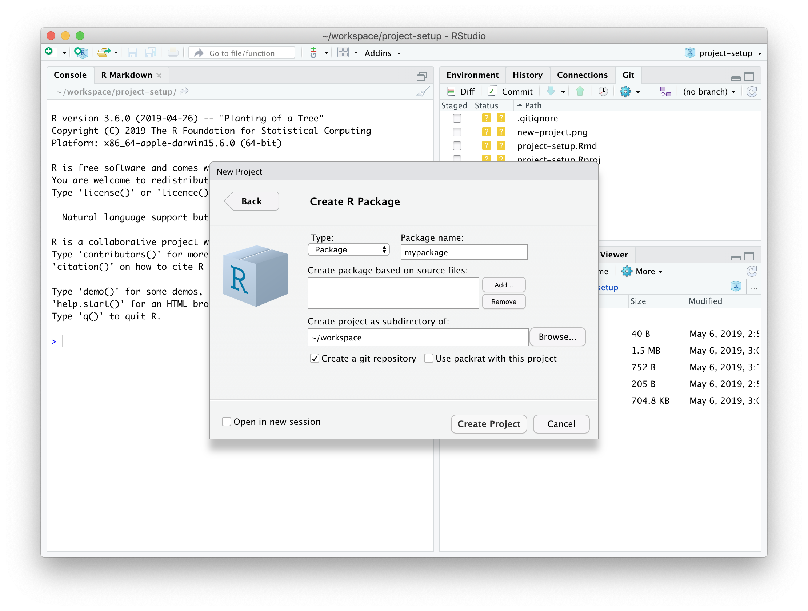
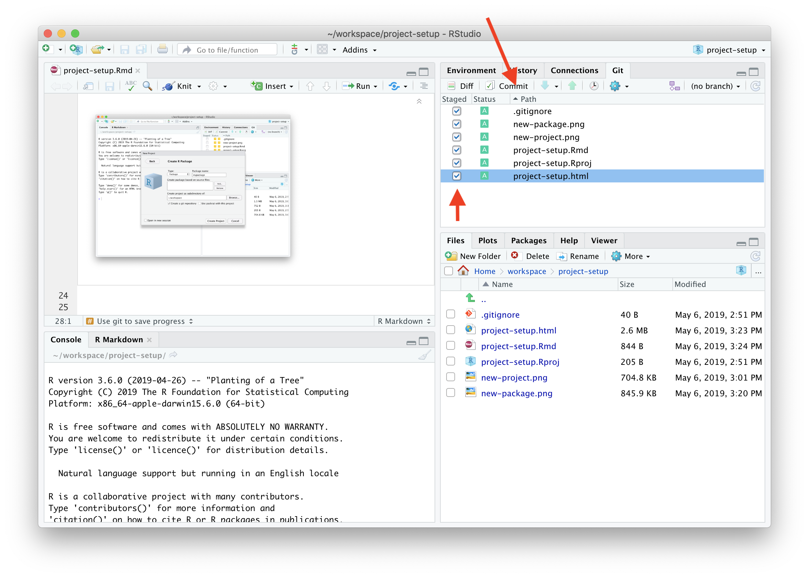

# Setting up your project

As the saying goes: well begun is half done. As you get started with your project, you can frame it such that you facilitate a reproducible workflow for the rest of the project. In this workshop we will focus on a few things:
* Publication & Licensing
* Project structure


## Publication & Licensing

Wait, why are we starting here? Isn't 'publication' the thing you do... _at the end?_

We recommend starting with a published (and thus _public_) version of an empty project, and choosing a license from the start. Doing this will encourage you throughout to keep the readability of your work in mind, and minimize the mess you will have to disentangle when you finally decide to make your project publicly available.

Of course, this is not a hard and fast rule. You may deal with sensitive data, and perhaps your code, while developing, contains direct references to this data. You may want to keep your code private because it is your as-yet unpublished, novel and groundbreaking analysis protocol or model, and you would prefer to remain unscooped. Whatever reason you have for wanting to stay private (for now), do consider whether your project may not benefit from being written openly.

Regardless of publication status, we encourage you to choose a license from the start. Even if a project is private, knowing what your license is will prevent you from generating content that does not match the license. For example: you may want to deploy someone else's code that is licensed in a way that is incompatible with the license you prefer. If you have not yet chosen your license, you may inadvertedly create conflicts.

Summarizing: the more you know about your project from the start, and can keep in mind as you proceed, the lower the chance that you will create something that conflicts with these standards that **should eventually all be part of your project**. Why not hit the ground running?

### Where to publish?

There are many websites designed to host code. You should choose a website compatible with the version control software you use, which will ideally not just make your work public, but also:
- allow others to see not just the code, but also individual commits you made and branches you work on;
- publish different releases;
- test your software;
- provide a platform for collaboration.

### Choosing a license

The default situation is that your work is under copyright, so nobody can use your code without your permission. You can fix this by adding a license to your work. 

* [_Pick a license, any license._ by Jeff Atwood (Coding Horror)](https://blog.codinghorror.com/pick-a-license-any-license/)
* [Want to choose an license? This tool helps!](https://choosealicense.com)


## Project Setup in R

Use an __"RStudio Project"__ + to organize files for an analysis project (scripts, data, results, documents, etc):



  
Alternatively: use an __R Package__ if your code is to be used by others outside of your own work, you should put it in a package. An R package is simply a folder with a standard layout on for R functions, documentation, data, and metadata. It makes it easy for yourself and others to install and use the code.





Regardless of working on a project or package, always use `git` to save your progress. 




  
The `usethis` R package helps you to automate package and project setup tasks. It makes everything that follows much easier. Make sure to check out the website: https://usethis.r-lib.org

# Setup a Git Repository

If not done yet in rstudio, initiate a git repository

```r
usethis::use_git()
```

Create a public project on Github:

```r
usethis::use_github()
```

# Set a license

The `License` is declared in the `DESCRIPTION` file. If you share your code on a public space, you should include a license to explain the user/reader what is allowed.

The most popular open-source licenses are MIT and GPL. The MIT license allows users to use the code for any other project (including commercial).

```r
usethis::use_gpl3_license()
```

The GPL license is more restrictive and only allows for using the code in other GPL open-source projects: 

```r
usethis::use_mit_license()
```

Both licenses require the copyright holder (you) is named in all source files.


### .gitignore

The .gitignore file in your template contains files that **by definition** will not be tracked by git.

For example, if you do not want to track a file .DS_Store (always present on my mac), you enter a line like this in your .gitignore file:
```bash
.DS_Store
```
Similarly, you can ensure all output in a folder will not be tracked:
```bash
results/
```

Or all files with a certain extension:
```bash
 *.dat 
```


# Glossary
| Concept | Definition |
|:-----------:|:-------------|
| License | A (legally binding) document with user guidelines, defining how the product (in this case: software) can be used and/or distributed. |
| Version control | |
| Commit | |
| Branch | |


